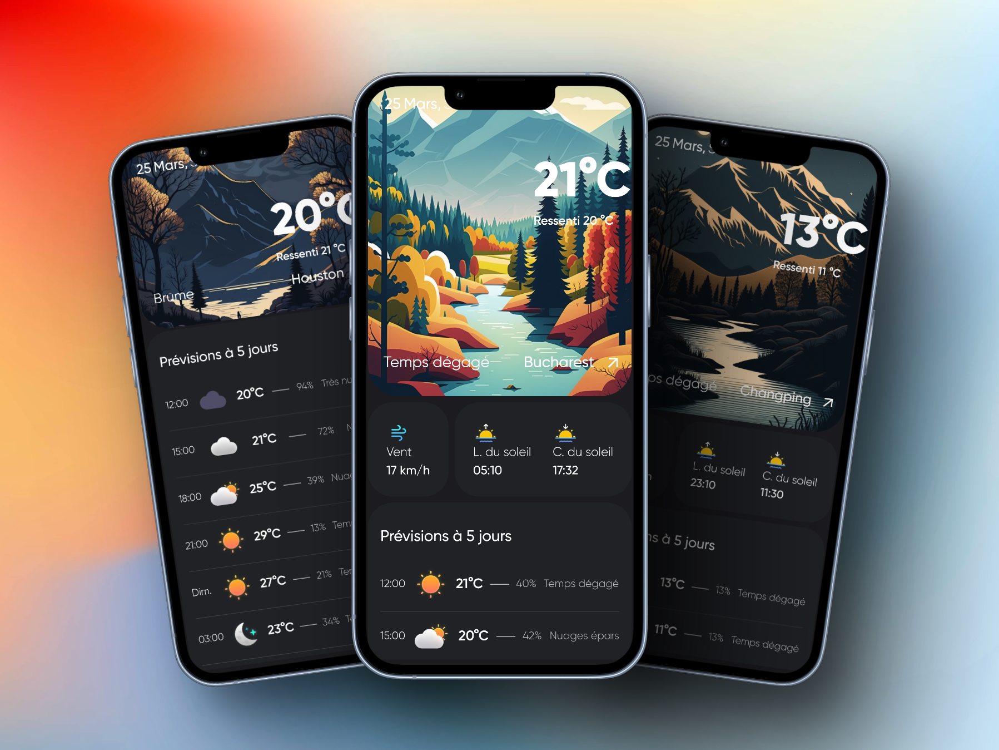
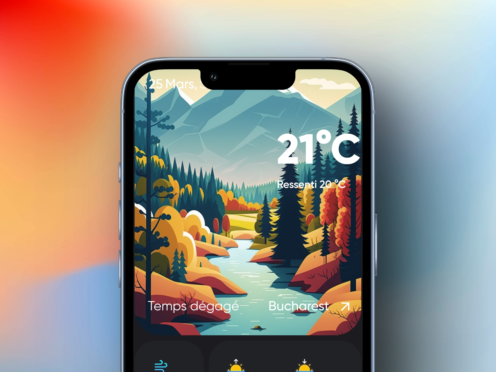
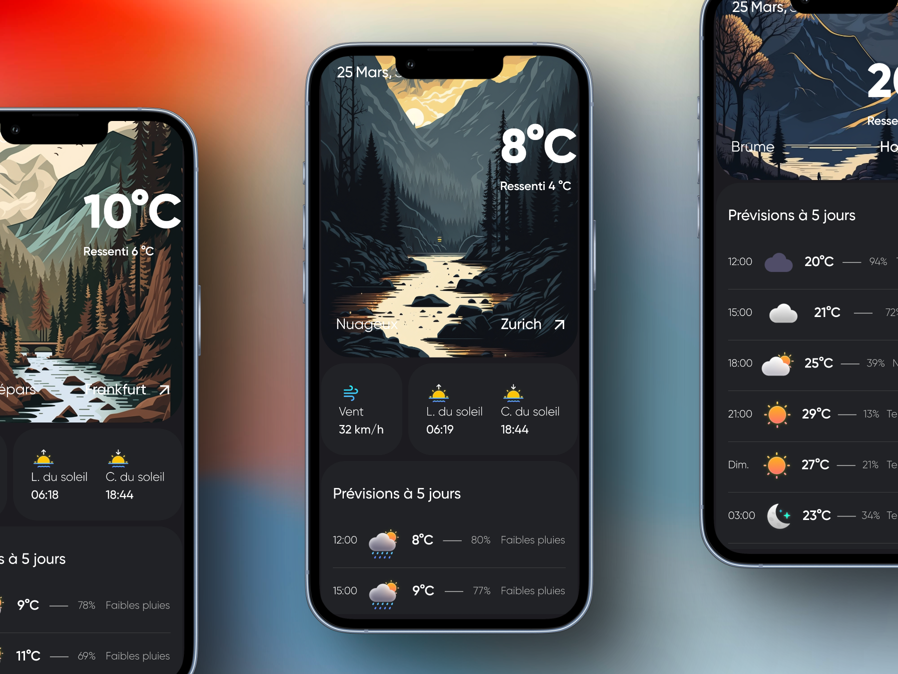

# My Weather App

  
  

 
This Weather app is developed with Flutter in Dart. The app is using the [OpenWeatherMap API](https://openweathermap.org/api) to fetch the weather data.
It's a simple app that shows the weather for the current location and the next 5 days. UI have been strongly worked.

Welcome to my Weather app! This app has been designed to provide you with accurate and up-to-date weather information for your current location and the next 5 days. It has been developed using Flutter in Dart, and it utilizes the [OpenWeatherMap API](https://openweathermap.org/api) to fetch the weather data.

One of the key features of this app is its user-friendly and intuitive design. The UI has been thoughtfully crafted to provide you with a seamless experience, and the layout has been optimized to ensure that the most important information is always front and center. With this app, you can easily view the current weather conditions, temperature, and wind speed, as well as a forecast for the 5 upcoming days.

_As it is a project for my school, all the text is in French and there is no available version in English_

## Illustrations
Illustrations are generated with [MidJourney](https://midjourney.app/) using the prompt "a digital vector illustration of a landscape representing mountains, a forest and a river on a bright sunny day, minimalist --q .25 --ar 4:7".

### Icons
- The icons used in this app are from [this dribbble](https://dribbble.com/shots/15349865-Cloudy-Icons-Light) by [ihmdone](https://dribbble.com/ihmdone).

### Inspiration for the UI
- The UI of this app is inspired by the [creative agency](https://dribbble.com/shots/20331883-Concept-Weather)

### Mockup
- The mockup for this app was created using [shots.so](https://shots.so/)